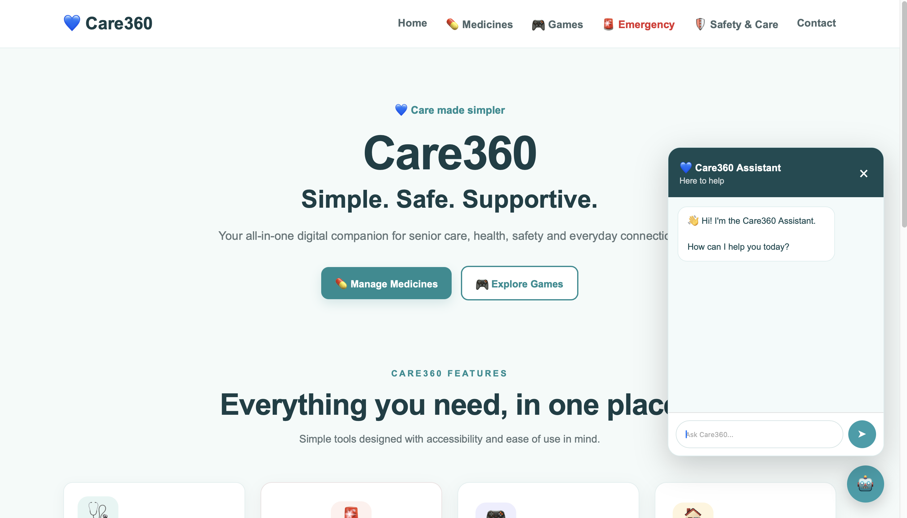
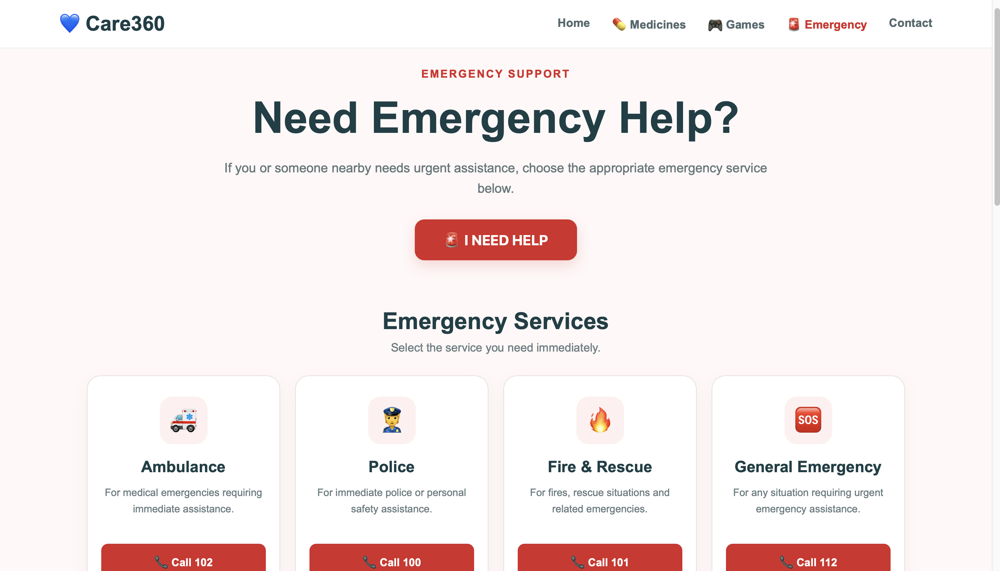
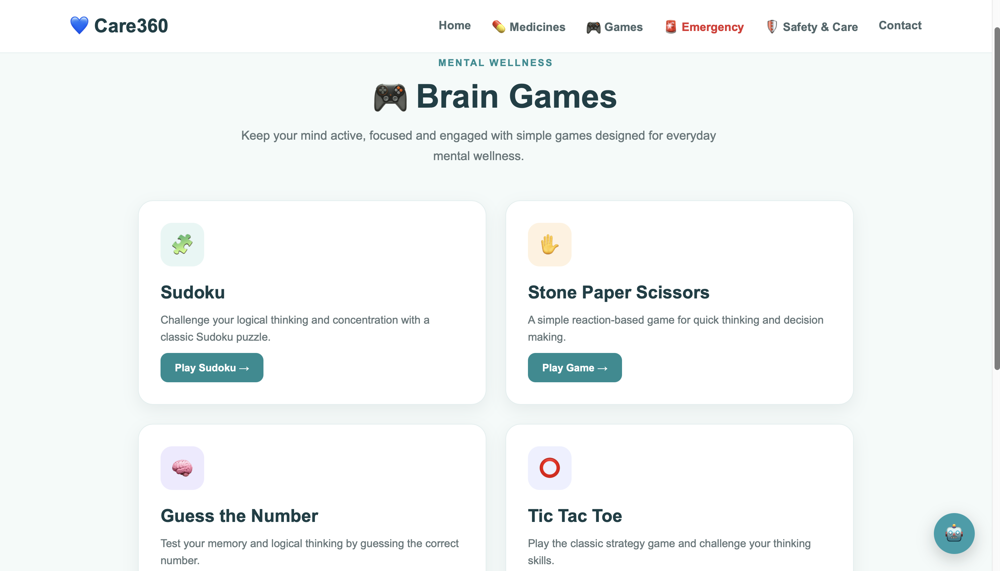
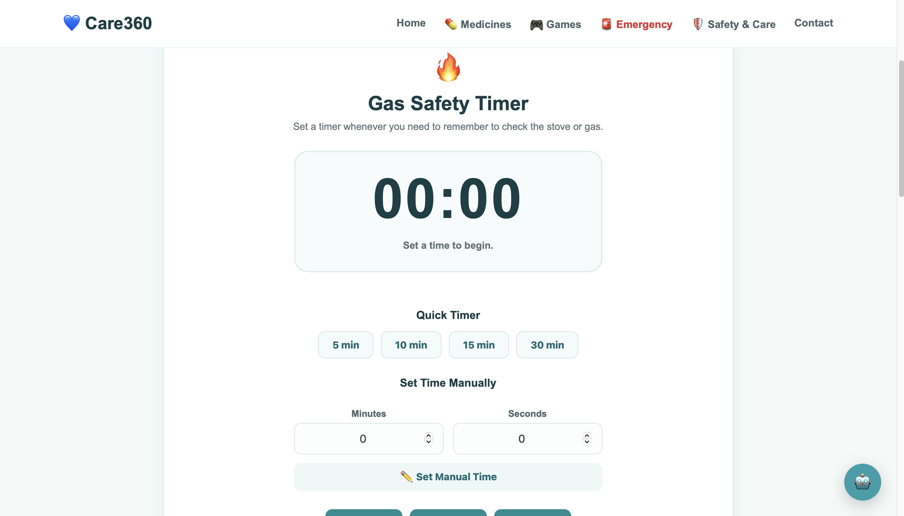
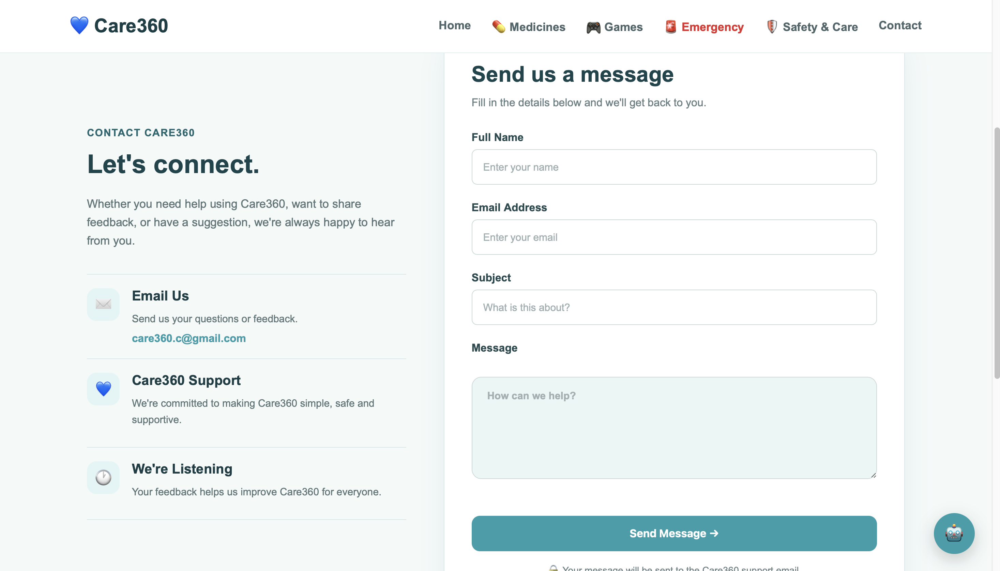

# 💙 HealthNest

### Simple. Safe. Supportive.

Care360 is an all-in-one digital healthcare and safety platform designed to provide users with essential tools for **medicine management, emergency assistance, safety reminders, brain games, and AI-powered support** in one easy-to-use web application.

🌐 **[Live Demo →](https://healthnest-kc4v.onrender.com/)]

---

## 📸 Screenshots

### 🏠 Home Page



### 🚨 Emergency Support



### 🎮 Games



### 🛡️ Safety & Care



### 📞 Contact


---

## ✨ Features

### 💊 Medicine Management

Care360 provides tools to help users keep track of their medicines and daily doses.

* Add medicines
* Manage medicine doses
* Track scheduled doses
* Mark doses as taken
* Mark doses as skipped
* Delete medicines
* View medicine information in one place

---

### 🚨 Emergency Support

Provides quick access to emergency-related assistance when users need it.

* Emergency support section
* Quick access to emergency services
* Emergency contacts and assistance
* Dedicated emergency page for faster access

---

### 🛡️ Safety & Care

A dedicated section containing practical safety tools and reminders.

#### 🔥 Gas Safety Timer

The Gas Safety Timer helps users remember to check their stove or gas after a chosen period.

Features include:

* Quick timer presets
* Custom minutes and seconds
* Start / Pause / Reset controls
* Visual timer countdown
* Timer completion alert
* 5-second audible beep alarm
* Browser notification support
* Safety reminders

> ⚠️ The timer is a reminder tool and should not replace direct supervision of cooking or gas appliances.

#### 🏠 Home Safety Checklist

Users can check common household safety precautions such as:

* Clear floors and walkways
* Proper lighting
* Accessible frequently used items
* Availability of emergency numbers

#### 🚶 Mobility & Fall Safety

Provides simple reminders for maintaining a safer environment while moving around the home.

#### 🛡️ Personal Safety

Includes reminders related to:

* Emergency contacts
* Important information
* Phone readiness

---

### 🎮 Brain Games

Care360 includes simple games for entertainment and mental activity.

Available games include:

* 🎯 Tic-Tac-Toe
* ✊ Rock Paper Scissors
* 🔢 Guess the Number
* 🧩 Sudoku

---

### 🤖 AI Assistant

Care360 includes an integrated AI assistant to provide conversational support and help users access information through the platform.

---

## 🛠️ Tech Stack

### Frontend

* HTML5
* CSS3
* JavaScript

### Backend

* Python
* Django

### Database

* SQLite

### AI

* Google Gemini API

### Deployment

* Render

### Version Control

* Git
* GitHub

---

## 📂 Project Structure

```text
Care360/
│
├── Care360/
│   ├── settings.py
│   ├── urls.py
│   ├── wsgi.py
│   └── ...
│
├── Care360_homepage_be/
│   ├── views.py
│   ├── urls.py
│   └── ...
│
├── medicines/
│   ├── models.py
│   ├── views.py
│   ├── urls.py
│   └── ...
│
├── emergency/
│   ├── views.py
│   └── ...
│
├── games/
│   ├── views.py
│   └── ...
│
├── safetycare/
│   ├── views.py
│   └── ...
│
├── templates/
│   └── ...
│
├── static/
│   └── Care360/
│       ├── Care360.css
│       ├── Care360.js
│       ├── ai-bot.js
│       └── ...
│
├── assets/
│   ├── home.png
│   ├── medicines.png
│   ├── emergency.png
│   ├── games.png
│   └── safety.png
│
├── manage.py
├── .txt
└── README.md
```

---

## 🚀 Running the Project Locally

### 1. Clone the repository

```bash
git clone https://github.com/YOUR-USERNAME/Care360.git
```

Then enter the project directory:

```bash
cd Care360
```

---

### 2. Create a virtual environment

```bash
python -m venv .venv
```

---

### 3. Activate the virtual environment

#### macOS / Linux

```bash
source .venv/bin/activate
```

#### Windows

```bash
.venv\Scripts\activate
```

---

### 4. Install dependencies

```bash
pip install -r requirements.txt
```

---

### 5. Apply database migrations

```bash
python manage.py migrate
```

---

### 6. Collect static files

```bash
python manage.py collectstatic --no-input
```

---

### 7. Start the Django development server

```bash
python manage.py runserver
```

Open the application at:

```text
http://127.0.0.1:8000/
```

---

## 🌐 Live Deployment

Care360 is deployed using Render.

### 🔗 Live Application

**https://care360-v7gn.onrender.com/**

The deployed application includes the Django backend, static files, database migrations, and Care360 frontend.

---

## 🔊 Gas Timer Alarm

The Gas Safety Timer uses the browser's **Web Audio API** to generate an audible alarm.

When the timer reaches zero:

```text
Timer reaches 00:00
        ↓
🚨 Timer Finished
        ↓
🔊 Repeated Beeps
        ↓
5 seconds
        ↓
🔇 Alarm Stops
```

No external audio file is required for the alarm.

---

## 🎯 Project Goal

The goal of Care360 is to bring several useful everyday healthcare and safety utilities together into a single, simple platform.

Instead of requiring users to rely on multiple separate tools, Care360 combines:

* Medicine tracking
* Emergency assistance
* Safety reminders
* Gas safety timer
* Brain games
* AI assistance

into one centralized web application.

---

## 💡 Why Care360?

Many everyday safety and healthcare tasks are simple but easy to forget.

Care360 focuses on making these tasks:

* **Simple**
* **Accessible**
* **Organized**
* **Easy to navigate**
* **Available from one platform**

The project is designed with a strong focus on usability and straightforward navigation.

---

## 🔮 Future Improvements

Possible future improvements include:

* 👤 User authentication and personalized profiles
* 🔔 Advanced medicine reminders
* 📍 Emergency location sharing
* 📞 One-tap emergency calling
* 🗄️ PostgreSQL production database
* 🤖 More advanced AI assistant capabilities
* ♿ Additional accessibility features
* 🔊 Customizable alarm sounds
* 📱 Improved mobile responsiveness
* 🎮 Additional games
* 📊 Personal health and activity dashboard

---

## 👩‍💻 Developer

### Rucha Kadam

Care360 was developed using:

**Python • Django • HTML • CSS • JavaScript**

Built with ❤️ to create a simple and supportive digital care platform.

---

## ⭐ Support

If you find this project useful, consider giving the repository a ⭐ on GitHub!

---

## 📄 License

This project is intended for educational and demonstration purposes.
